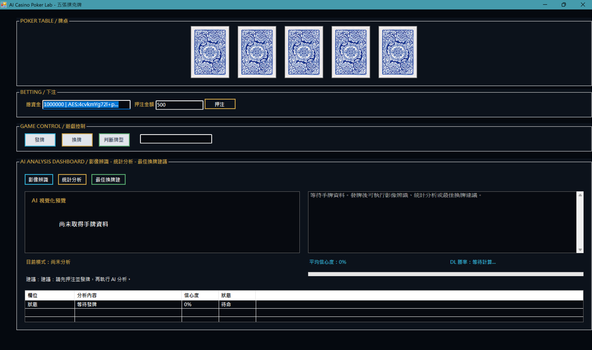
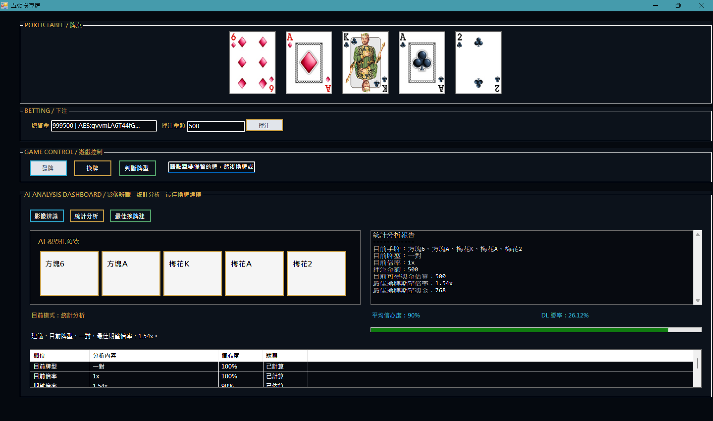
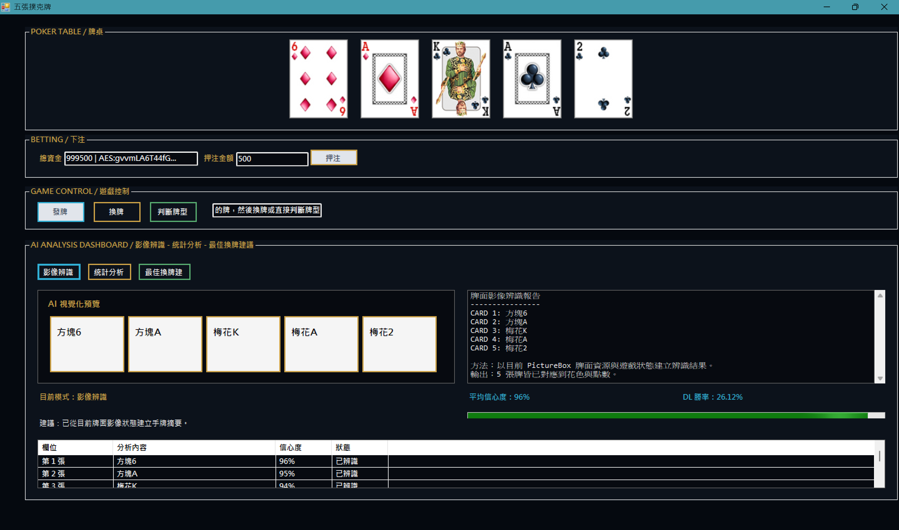
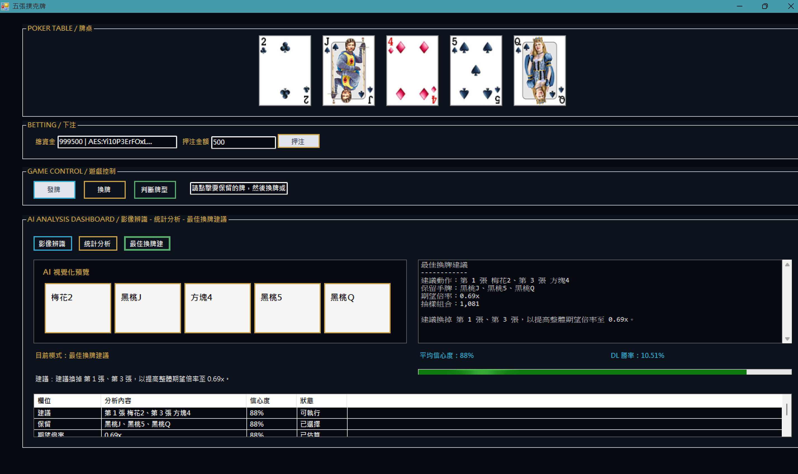
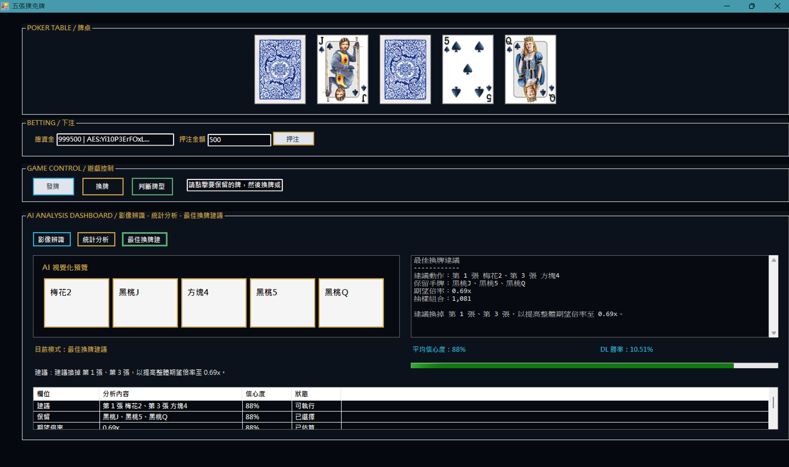
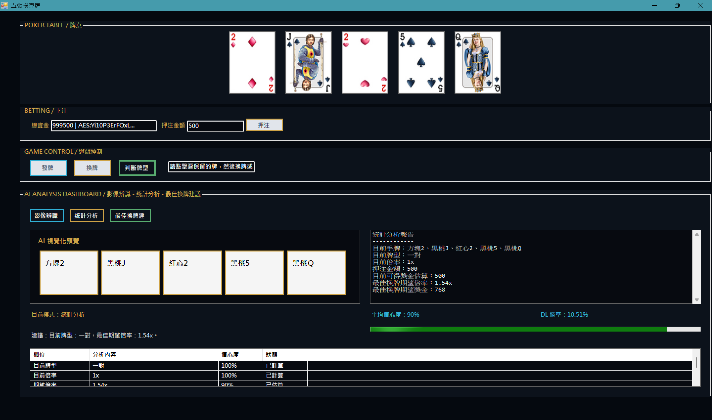
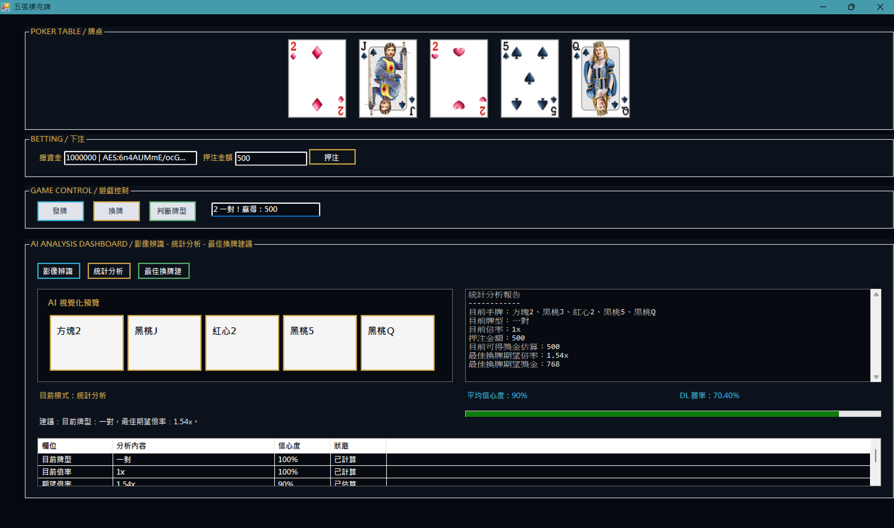

# Poker

這是一個使用 C# WinForms 製作的五張撲克牌遊戲。

## 專案截圖

### 初始畫面

### 發牌與統計分析

### 牌面狀態摘要

### 最佳換牌建議

### 選擇換牌

### 換牌後統計分析

### 牌型判斷與結算

## 核心功能

- 五張撲克牌遊戲流程：押注、發牌、換牌、牌型判斷與獎金結算。
- 響應式 WinForms 介面：視窗縮放時會調整牌桌與主要控制區配置。
- AI 分析儀表板：提供牌面摘要、統計分析與最佳換牌建議。
- 資安防護機制：使用 AES、SHA-256 與 HMAC-SHA256 保護資金狀態完整性。

## 執行說明

1. 使用 Visual Studio 開啟 `Poker.slnx`。
2. 專案目標框架為 .NET Framework 4.7.2。
3. 建置方案後執行 `Poker` 專案。
4. 進入遊戲後先輸入押注金額並按下「押注」，再依序使用「發牌」、「換牌」與「判斷牌型」功能。

### 撲克牌遊戲
- 支援押注、發牌、換牌與牌型判斷。
- 依照牌型倍率計算獎金與更新資金。
- 可點擊牌面選擇要換掉的牌。

### 響應式介面設計 (Responsive UI)
- 支援視窗縮放。撲克牌及主要 UI 控制項會根據可用版面等比例擴展與置中。

### AI 分析儀表板
- **牌面狀態摘要**：依據目前 PictureBox 牌面資源與遊戲狀態，整理 5 張牌的花色與點數。
- **統計分析**：計算目前牌型、倍率、押注後預估獎金與換牌期望倍率。
- **最佳換牌建議**：分析保留與換牌組合，提供應保留或換掉的牌與期望倍率。

### 模擬深度學習 (Simulated Deep Learning)
- **智能勝率顯示**：以模擬神經網路計算方式動態顯示勝率百分比，並顯示於 AI 分析儀表板中。

### 資安防護 (InfoSec / CIA Triad)
- **機密性 (Confidentiality)**：資金狀態會使用 AES 加密，並以 Base64 token 顯示加密後的狀態摘要。
- **完整性 (Integrity)**：每次押注與結算都會以 SHA-256 與 HMAC-SHA256 建立驗證碼，下一次資金操作前會重新驗證，偵測到狀態不一致時會鎖定遊戲。
- **可用性 (Availability)**：主要遊戲操作都包在集中式例外處理流程中，發生驗證失敗或未預期錯誤時會停用下注、發牌、換牌與判斷牌型按鈕，避免錯誤狀態繼續擴散。

---
*Developed with C# WinForms*
